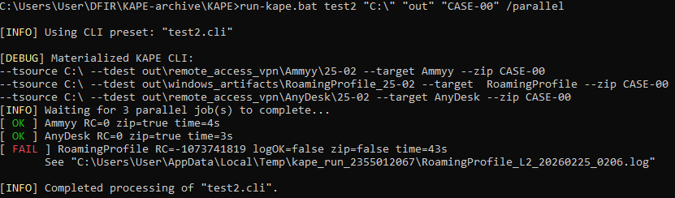

# KAPE-Able

 This project is a handy batch wrapper for KAPE presets. It runs targets one-by-one and sorts output folders automatically.

> [!CAUTION]
> Currently tested with kape.exe version 1.3.0.2


[Source of this image](https://ericzimmerman.github.io/KapeDocs/#!index.md#how-kape-works).

```sh
C:\Users\Simon\KAPE>run-kape /banner
==============================================================
KAPE-Able - Batch Runner for KAPE presets
--------------------------------------------------------------
Author: SimonL01
Email: none4rB4s1n3ss
Copyright: GNU General Public License v3.0
--------------------------------------------------------------
Tip: Ctrl+C to stop. Logs are written per target.
Tip: /help for help and usage examples.
--------------------------------------------------------------
\|/           (__)
      `\------(oo)
        ||    (__)
        ||w--||     \|/
\|/                                                                                                                                                          ==============================================================
```

# How to Use

> [!CAUTION]
> Need Admin rights to run !!!

```sh
C:\Users\Simon\KAPE\KAPE>run-kape /help
Usage:
      run-kape.bat /list                                     > Show available configurations and exit
      run-kape.bat /help                                     > Show this help and exit
      run-kape.bat /banner                                   > Show banner and exit
      run-kape.bat NAME SRC DEST_ROOT ZIP_TAG                > Name of CLI. Runs each CLI line, splits --target A,B,C
      run-kape.bat NAME SRC DEST_ROOT ZIP_TAG /parallel      > Same, but run targets in parallel
Examples:
      run-kape.bat test "C:" ".\out" "CASE-SLO"
      run-kape.bat test "C:" ".\out" "CASE-SLO" /parallel
```

Do not forget that for the script to run, kape.exe must be present, with its folders and respective templates.
Example of the repository structure can be:
```text
kape-able/
├─ cli/
│  ├─ antivirus.cli
│  ├─ windows_artifacts.cli
│  └─ ...
│  └─ make-cli.ps1
│  └─ ...
├─ Modules/
├─ Targets/
├─ gkape.exe
├─ kape.exe
└─ run-kape.bat
```

# Target Consideration

The target name starting with a '!' must be dealt with so that CMD parser does not interpret it as a variable:
```txt
--tsource %1 --tdest %2\triage_collections\BasicCollection_%d-%m --target ^!BasicCollection --zip %3
```

# Reparse Point Failures

KAPE is not immune to broken reparse points, but the main script and its jobs still run correctly.



# Useful Links

KAPE Getting Started Documentation :
- https://ericzimmerman.github.io/KapeDocs/#!Pages%5C2.-Getting-started.md

Official GitHub repository for community created Targets and Modules:
- https://github.com/EricZimmerman/KapeFiles

Tips and Tricks:
- https://ericzimmerman.github.io/KapeDocs/#!Pages%5C60-Tips-and-tricks.md

Awesome KAPE:
- https://github.com/AndrewRathbun/Awesome-KAPE


