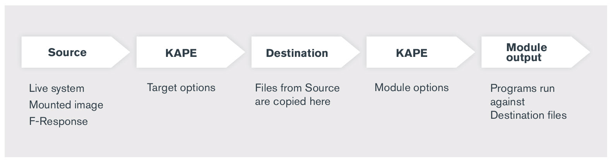
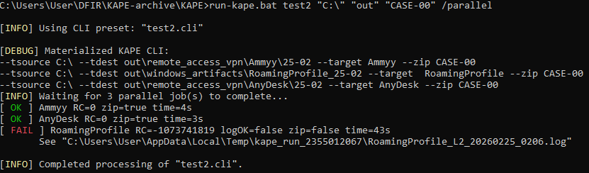

# KAPE-Able

 This project is a handy batch wrapper for KAPE presets. It runs targets one-by-one and sorts output folders automatically.

> [!CAUTION]
> Currently tested with kape.exe version 1.3.0.2


[Source of this image](https://ericzimmerman.github.io/KapeDocs/#!index.md#how-kape-works).

```sh
C:\Users\Simon\KAPE>run-kape /banner
==============================================================
KAPE-Able - Batch Runner for KAPE presets
--------------------------------------------------------------
Author: SimonL01
Email: none4rB4s1n3ss
Copyright: GNU General Public License v3.0
--------------------------------------------------------------
Tip: Ctrl+C to stop. Logs are written per target.
Tip: /help for help and usage examples.
--------------------------------------------------------------
\|/           (__)
      `\------(oo)
        ||    (__)
        ||w--||     \|/
\|/                                                                                                                                                          ==============================================================
```

# How to Use

> [!CAUTION]
> Need Admin rights to run !!!

Using the `full` preset is highly recommended for better forensic data acquisition.
```cmd
run-kape.bat full "C:" ".\out" /nozip /batonly /parallel
```
- `/batonly` and `/parallel` could be a problem on some systems. These are not mandatory and can be removed if necessary. Specifically the `/parallel` flag for systems that can't put too much pressure on RAM.

Else:
```cmd
run-kape.bat full "C:" ".\out" /nozip
```

For more help information:
```sh
C:\Users\Simon\KAPE\KAPE>run-kape /help
Usage:
      run-kape.bat /list                                     > Show available configurations and exit
      run-kape.bat /help                                     > Show this help and exit
      run-kape.bat /banner                                   > Show banner and exit
      run-kape.bat NAME SRC DEST_ROOT ZIP_TAG                > Name of CLI. Runs each CLI line, splits --target A,B,C
      run-kape.bat NAME SRC DEST_ROOT ZIP_TAG /parallel      > Same, but run targets in parallel
      run-kape.bat NAME SRC DEST_ROOT /nozip                 > Collect raw files only. Ignores any --zip in the preset
      run-kape.bat NAME SRC DEST_ROOT ZIP_TAG /nozip         > Same as above, but keeps the usual argument shape
Examples:
      run-kape.bat test "C:" ".\out" "CASE-SLO"
      run-kape.bat workstation "C:" "E:\Cases\CASE-001\HOST01" "CASE-001_HOST01"
      run-kape.bat server "C:" "E:\Cases\CASE-001\HOST01" "CASE-001_HOST01"
      run-kape.bat test "C:" ".\out" "CASE-SLO" /parallel
      run-kape.bat server "C:" ".\out" /nozip
```

It is highly recommended to run with the `full` cli configuration file for a full forensic data acquisition.

Do not forget that for the script to run, kape.exe must be present, with its folders and respective templates.
Example of the repository structure can be:
```text
kape-able/
├─ cli/
│  ├─ antivirus.cli
│  ├─ windows_artifacts.cli
│  └─ ...
│  └─ make-cli.ps1
│  └─ ...
├─ Modules/
├─ Targets/
├─ gkape.exe
├─ kape.exe
└─ run-kape.bat
```

# Configuration Files

Note that configuration files are specific to whether or not it is run in parallel and this is because processes must not try to access resources used by other processes. If a single command line contains more than one targets, use sequential mode (by default). If multiple ligns contains one target per line, parallelism is allowed.
One kape.exe process is launched per lign in the '.cli' file, if multiple targets are specified on the same lign, concurrency problems could arise.

Concretely:
- Run sequentially (by default) for configuration files made of a single lign with multiple targets.
- Run with parallelism ('/parallel') only configuration files where each lign is one target.

For instance, have a look at 'cli/windows-parallel.cli' and 'cli/windows-seq.cli'.

# Output

The output folder specified in the command line will create for each preset (classification of which type of target), a folder with the name of the target.
The later will have the console log of kape.exe using that target and the evidences zipped if no `/nozip` flag.
```text
<output_name>/
├─ _kape_jobs/
├─ <preset_name>/
│  └─ <target_name>_day_month
│     ├─ <evidences>
│     ├─ <target_name>_<timestamp>_ConsoleLog.txt
│     └─ <target_name>_<timestamp>_<basename>.zip
└─  ...
```

With the `/nozip` flag, evidences are not zipped, making it easier to process them afterwards (highly recommended).

# Target Consideration

The target name starting with a '!' must be dealt with so that CMD parser does not interpret it as a variable:
```txt
--tsource %1 --tdest %2\triage_collections\BasicCollection_%d-%m --target ^!BasicCollection --zip %3
```

# Reparse Point Failures

KAPE is not immune to broken reparse points, but the main script and its jobs still run correctly.



# Known Limitations

TODO: Fix the sequential mode so that outputs and evidences don't go into a zip loop when flag `/nozip` is not used.

Also, if for any reason, you are editing this file using a UNIX-like environment, pay attention to `LF` characters as Windows native `.bat` files won't be parsed correctly.
An easy fix is to use PowerShell to fix the line endings for `CRLF`:
```powershell
(Get-Content "run-kape.bat") | Set-Content "run-kape.bat"
```
- `(Get-Content "...")`: Reads the entire file into memory line-by-line. The parentheses are crucial because they ensure PowerShell finishes reading and closes the file before moving to the next step (otherwise, you'd get a "file in use" error). In doing so, it strips away the existing line endings (whether they are LF or CRLF).
- `|`: Pipes those lines to the next command.
- `Set-Content "..."`: Writes the lines back into the same file. Since you are on Windows, Set-Content automatically appends the standard Windows CRLF (Carriage Return + Line Feed) to the end of every line.

# Useful Links

KAPE Getting Started Documentation :
- https://ericzimmerman.github.io/KapeDocs/#!Pages%5C2.-Getting-started.md

Official GitHub repository for community created Targets and Modules:
- https://github.com/EricZimmerman/KapeFiles

Tips and Tricks:
- https://ericzimmerman.github.io/KapeDocs/#!Pages%5C60-Tips-and-tricks.md

Awesome KAPE:
- https://github.com/AndrewRathbun/Awesome-KAPE


